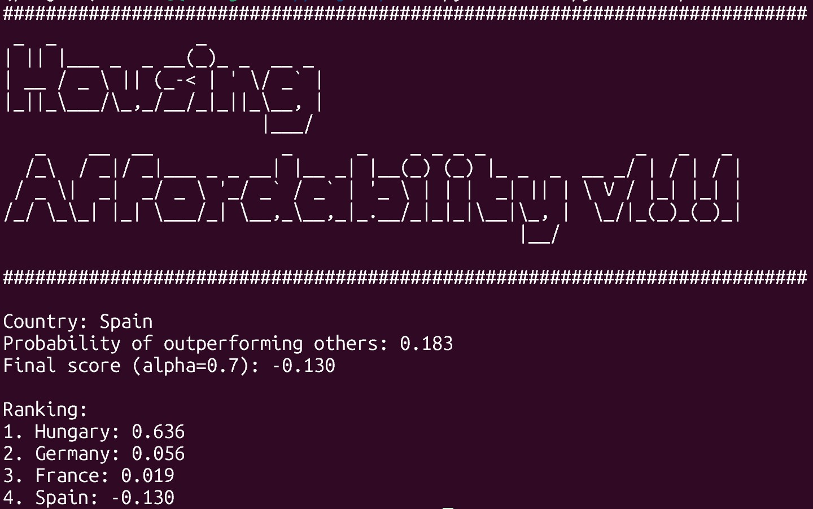

# Housing Affordability Analysis in Europe

---

## Overview

This project performs an applied statistical analysis of housing affordability across European countries using official public data sources. The analysis integrates data engineering, statistical modelling, and visualization to explore how housing prices evolve across countries and regions.

* **Eurostat API** (European data)
* **INE API** (Spanish national data)

The objective is to understand how housing prices evolve and compare affordability between countries and regions using data science and statistical methods.

The project integrates:
- Data collection from APIs (Eurostat and INE)
- Data cleaning and transformation
- Statistical analysis and comparison
- Visualization of trends and regional differences
- A scoring model for evaluating relative performance

---

## Installation

### 1. Clone the repository

```bash
git clone https://github.com/qeguia/project.git
cd project
```

### 2. Create the environment using the .yml file

```bash
conda env create -f environment.yml
```

### 3. Activate the environment
```bash
conda activate project
```

---

## Usage
This project uses a `src/`-based structure. 
The project is executed through a unified command-line interface that dispatches execution depending on the selected data source.
To ensure imports work correctly, all commands must be executed from inside the `src` directory:

```bash
cd src
```

From there, run the project using the main entry point:
```bash
python main.py <source> [options]
```

Where ```<source>``` is one of:
- ```eurostat``` → European data analysis
- ```ine``` → Spain regional analysis
- ```stats```→ Statistical scoring model
  
Note: the `stats` mode requires a country name as a positional argument.

### Eurostat analysis:
#### Spain vs EU average:

```bash
python main.py eurostat
```

#### Country comparison:

```bash
python main.py eurostat --country1 ES --country2 PT
```

### INE Regional Analysis
To produce a bar chart by region

```bash
python main.py ine
```

### Statistical Model
Compute the score for a specific country:

```bash
python main.py stats Spain
```

With custom weighting parameter:
```bash
python main.py stats Spain --alpha 0.5
```
Available countries:
- Spain
- France
- Germany
- Hungary


---
## Output Example

### Eurostat Analysis


### Country Comparison


### INE Regional Analysis


### Statistical Model Output


---

## Statistical Model

The project includes a scoring model to compare countries in terms of housing affordability performance. The values of ´P_i´ and ´A_i´ are derived from the statistical analysis described in the report.

### Model Definition

Each country is characterized by two quantities:

- `P_i`: probability that the country outperforms others  
- `A_i`: performance indicator derived from the data  

Since `A_i` may not be directly comparable across countries, it is normalized:

$$
A_i^{norm} = \frac{A_i}{\max(A)}
$$

The final score is defined as:

$$
S_i = \alpha P_i + (1 - \alpha) A_i^{norm}
$$

where `alpha` ∈ [0, 1] is a weighting parameter controlling the trade-off between both components.

### Interpretation

| Component     | Meaning |
|--------------|--------|
| `P_i`        | Probability that a country outperforms others |
| `A_i_norm`   | Normalized performance magnitude |
| `alpha`      | Weight controlling the balance between both components |

**Effect of alpha:**
- `alpha → 1`: prioritizes probability
- `alpha → 0`: prioritizes performance magnitude


---

## Project Structure

```
project/
│── src/
│   ├── main.py              # Entry point (DO NOT bypass)
│   ├── main_eurostat.py     # Eurostat pipeline
│   ├── main_ine.py          # INE pipeline
│   ├── mainstats.py         # Statistical model
│   ├── banner.py 
│   ├── analysis/
│   ├── data_cleaning/
│   └── plot/
│
│── images/
│── tests/
│── docs/
│── environment.yml
│── setup.py
│── README.md
```

---

## Testing

Run all tests:

```bash
pytest -v
```

Tests cover:

* Data cleaning
* Analysis functions
* Error handling
* Edge cases

---
## Documentation (Sphinx)

This project includes automatically generated documentation using **Sphinx**.

The documentation is built from the source code and provides a structured overview of modules, functions, and project components.

### View the documentation

If the documentation has already been built, open the main page:
```bash
docs/build/html/index.html
```
You can open it in your browser:
- **Windows**
```bash
start docs/build/html/index.html
```
- **Linux**
```bash
xdg-open docs/build/html/index.html
```
- **macOS**
```bash
open docs/build/html/index.html
```
### Rebuild the documentation

If you want to regenerate the documentation from source:

```bash
cd docs
make html
```
After building, open again:
```bash
docs/build/html/index.html
```

### Notes

- The documentation is generated automatically from the codebase and `.rst` files located in:
```
docs/source/
```
- The compiled HTML output is stored in:
```
docs/build/html/
```
- The entry point is always:
```
index.html
```
---

## Technologies:

* Python
* Pandas
* NumPy
* Plotnine
* Eurostat API
* INE API (ineapy)
* Pytest
* Sphinx (documentation)

---

## Contributing:

This is an academic project, but contributions should follow basic software practices:
- Use feature branches
- Write clear commit messages
- Ensure code is tested before merging
- Maintain modular and readable code

---

## Versioning:

Git is used with multiple branches for:

* Feature development
* Testing
* Integration

---

## License:

This project is intended for academic use within:
- Computer Programming II
- Probability and Statistics

No formal license has been defined.

