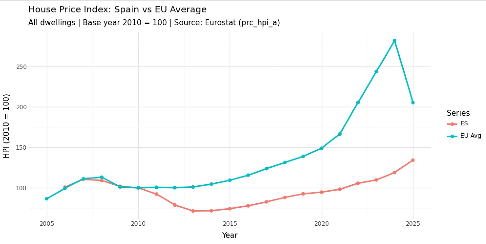
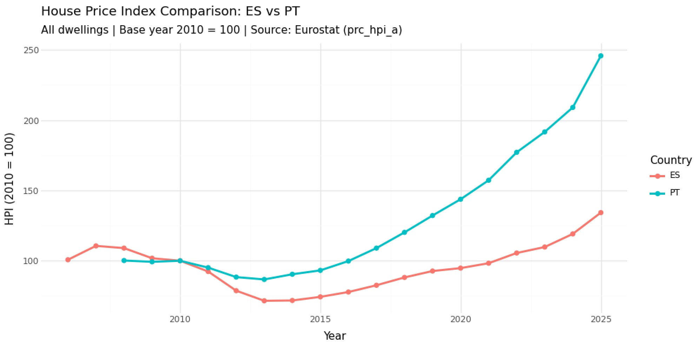
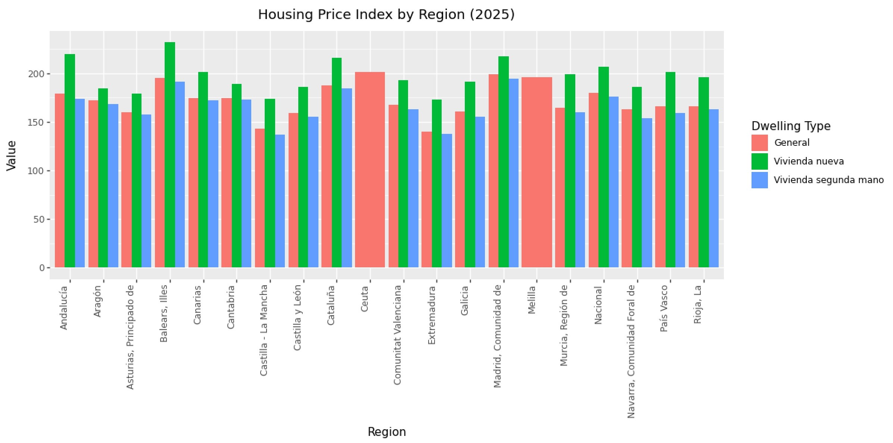

# Housing Affordability Analysis in Europe

---

## Overview

This project performs an applied statistical analysis of housing affordability across European countries using official public data sources. The analysis integrates data engineering, statistical modelling, and visualization to explore how housing prices evolve across countries and regions.

* **Eurostat API** (European data)
* **INE API** (Spanish national data)

The objective is to understand how housing prices evolve and compare affordability between countries and regions using data science and statistical methods.

The project integrates:
- Data collection from APIs (Eurostat and INE)
- Data cleaning and transformation
- Statistical analysis and comparison
- Visualization of trends and regional differences
- A scoring model for evaluating relative performance

---

## Installation

### 1. Clone the repository

```bash
git clone https://github.com/qeguia/project.git
cd project
```

### 2. Create the environemnt using the .yml file

```bash
conda env create -f environment.yml
```

### 3. Activate the environemnt
```bash
conda activate project
```

---

## Usage
This project follows a `src/`-based structure.  
All commands must be executed from inside the `src` directory to ensure imports work correctly.

```bash
cd src
```

From there, run the project using the main entry point:
```bash
python main.py <source> [options]
```

Where ```<source>``` is one of:
- ```eurostat``` → European data analysis
- ```ine``` → Spain regional analysis

### Eurostat analysis:
To produce a Spain versus Europe comparison plot.

```bash
python main.py eurostat
```

### Country comparison:
To generate a comparative visualization.

```bash
python main.py eurostat --country1 ES --country2 PT
```

### INE Regional Analysis
To produce a bar chart by region

```bash
python main.py ine
```
---
## Example Output

### Eurostat Analysis


### Country Comparison


### INE Regional Analysis


---

## Statistical Model

The project includes a scoring function to evaluate the relative performance of countries in terms of housing affordability.

The score for each country \( i \) is defined as:

$$
S_i = \alpha P_i + (1 - \alpha)\frac{A_i}{\max(A)}
$$

### Where:

- **Pᵢ**: Probability that country *i* outperforms others  
- **Aᵢ**: Risk-adjusted return (or performance metric)  
- **α ∈ [0,1]**: Weighting parameter controlling the importance of each component  

### Interpretation

- **Pᵢ** captures relative performance in probabilistic terms  
- **Aᵢ / max(A)** normalizes performance to ensure comparability across countries  
- **α** balances probability-based vs magnitude-based evaluation  

By default, **α = 0.7**, placing more emphasis on probabilistic performance.

### Example

```python
from mainstats import compute_final_scores

P = [0.6, 0.7, 0.8]   # Probabilities
A = [100, 120, 90]    # Risk-adjusted values

scores = compute_final_scores(P, A)
print(scores)
```

---

## Project Structure

```
project/
│── src/
│   ├── main.py              # Entry point (DO NOT bypass)
│   ├── main_eurostat.py     # Eurostat pipeline
│   ├── main_ine.py          # INE pipeline
│   ├── mainstats.py         # Statistical model
│   ├── banner.py 
│   ├── analysis/
│   ├── data_cleaning/
│   └── plot/
│
│── images/
│── tests/
│── docs/
│── environment.yml
│── setup.py
│── README.md
```

---

## Testing

Run all tests:

```bash
pytest -v
```

Tests cover:

* Data cleaning
* Analysis functions
* Error handling
* Edge cases

---

## Technologies:

* Python
* Pandas
* NumPy
* Plotnine / Matplotlib
* Eurostat API
* INE API (ineapy)
* Pytest
* Sphinx (documentation)

---

## Contributing:

This is an academic project, but contributions should follow basic software practices:
- Use feature branches
- Write clear commit messages
- Ensure code is tested before merging
- Maintain modular and readable code

---

## Versioning:

Git is used with multiple branches for:

* Feature development
* Testing
* Integration

---

## License:

This project is intended for academic use within:
- Computer Programming II
- Probability and Statistics
Both subjects taken at IE University.
No formal license is currently defined.

